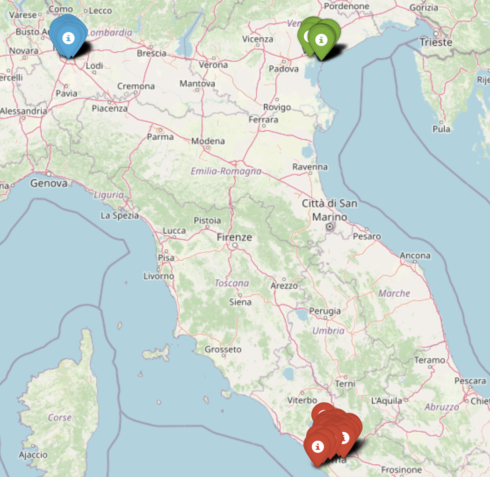
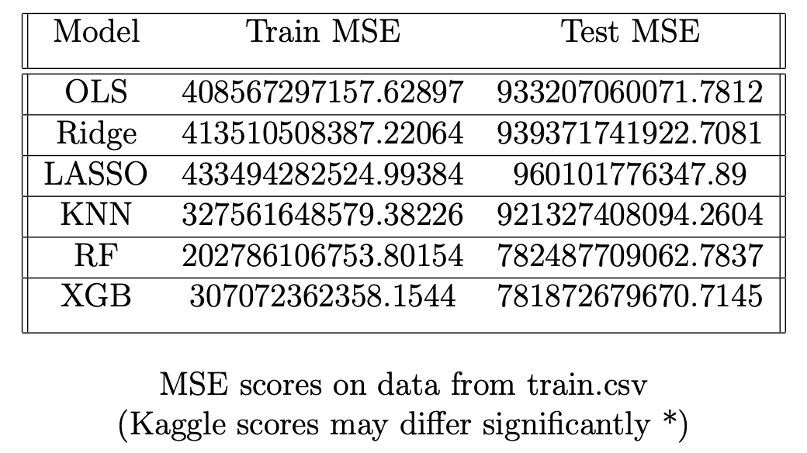

# House Price Prediction in Italy with ML

    

## Introduction

The challenge was centered around predicting house prices in Italy based on a number of features, such as surface, geo-location, number of rooms, etc. This implied that the task was a regression problem with mean squared error (MSE) as its metric. The data available was split into two different datasets: train.csv and test.csv. We chose to use 80% of the training data to learn the models and the remaining 20% for validation purposes. After selecting the best model, we trained it on the entire training set and then made predictions using the data in the test set.

## Data exploration & preparation

We performed a descriptive analysis of the training data to understand the main characteristics of the variables. The target variable *price* was observed to have a highly skewed distribution, with upper outliers being several orders of magnitude larger than the mean. By applying the log-transformation to the sample distribution we obtained a slightly right-skewed bell-shaped curve that resembles the Gaussian distribution (skewness coefficient = 0.529227 \& kurtosis = 2.586761). 
We were also interested in the covariates of the target variable that we studied using scatterplots, boxplots and correlation matrices. The strongest correlations observed were those between *price* and *surface*, *n\_rooms*, and *n\_bathrooms*, while other variables, such as *conditions*, and *proximity\_to\_center* exhibited low correlation scores.
Finally, we noticed a high number of missing values. Aware of the multitude of possibilities of approaching this aspect, we experimented with different imputation methods, including: mean, median, random number generation, dropping rows and dropping columns. We found a reasonable approach to be the following: 

* categorical variables: imputation with `False`/`0` for binary variables and either a one-hot encoding or complete removal of *conditions*. For the binary variables, the choice seemed sensible given the lack of additional information, whereas the choice made with respect to *conditions* proved irrelevant, due to its lack of correlation with the target variable and its rather arbitrary nature.
* numerical variables: imputation with the mean for real values and with the median for discrete values. In spite of the disadvantages of this approach (loss of correlation across features, potential bias, etc.), we found its simplicity and limited negative impact on feature covariance to be satisfactory. Another approach we tried was generating random values centered around the mean of each feature's distribution, but there was only a limited impact on feature correlation and model performance.

## Feature creation and selection

After cleaning and preparing the data, we were interested in understanding the relevance of the different variables for our analysis. To further augment the explanatory power of our data, we decided to create new features based on intuition and domain-specific knowledge. 
In the real estate business, one of the central attributes determining the value of a property is location. To translate this into our analysis, we first grouped the observations by location *latitude* \& *longitude* using **K-means clustering**. This procedure yielded the three cities present in our data: Milan, Rome, and Venice. A quick empirical analysis showed that average prices are significantly higher in Milan relative to the other two cities. We then incorporated the city information into a one-hot encoding format. This information proved more significant for linear models (because it acts as a shift in the intercept for each city) and KNN, while tree-based methods were able to create reasonable decision regions by using *latitude* \& *longitude* directly.

    

Another relevant predictor of price is assumed to be the average price in a given neighbourhood. The reasoning behind this assumption is that certain characteristics are shared by homes in the same area: traffic, safety, cleanliness, etc. In our case, for each property, we looked at the closest 200 homes and computed the average price. To implement this efficiently, we used a **k-d tree** data structure (implemented with `scipy.spatial.cKDTree` in Python). We incorporated these values into our data by creating the column *avg\_price*.
One potential risk of this approach is posed by the presence of outliers that could artificially raise the average price and cause the model to overfit, but we believe that on average this should not be a significant concern. We also considered another feature similar to the average price, the average price per squared meter in a given neighbourhood. The issue with this variable was caused by the anomalies in the observations of the *surface* variable, since 0 or very low values would increase the average significantly and imputation with the mean surface for these misleading values did not yield promising results (low correlation with the final price). We decided to keep our initial variable *avg\_price* even though it disregards the surface of the apartment. 
Finally, the most linearly correlated variables with our target variable are: *surface*, *avg\_price*, *n\_rooms*, *n\_bathrooms*, *expenses*, *elevator*, and *Milano*. 

## Model selection: Linear Model \& KNN
The first model we tried was the standard **OLS regression** using only the most correlated features. This yielded an $R^2$ of around 0.75. Regularized models such as **Ridge \& Lasso regression** performed similarly, with no significant reduction in MSE. This is potentially due to the fact that we conducted feature selection and transformation (log-transform to ensure that variables are on the same scale) prior to building the models, thereby not requiring significant regularization. 
**KNN regression**, on the other hand, seemed to perform marginally better than the linear models after tuning the hyper-parameter through cross-validation. This might suggest the non-linear structure of the data, and the need for more powerful methods that can learn non-linear functions of the input. 
Overall, linear models and KNN were a solid starting point in our analysis. The high difference between train and test error is a sign of overfitting, but this might be due to extreme outliers that drastically affect our metric. The performance scores of these models were used as benchmarks for more complex models.

\section{Model selection: Ensemble methods}
As noted earlier, we believe that the prediction of the target variable requires a non-linear model. To verify this claim, we implemented and tuned bagging (**Random Forest**) and boosting models (**XGBoost**). Unlike for the previous models, we used a high number of features without applying any transformations, since decision tree are scale-independent and overfitting can be countered through regularization. Out-of-the-box performance was already better than linear models and KNN, but significant gains were made by tuning the hyper-parameters. 
In particular, the `n_estimators` and `max_depth` were the most relevant parameters for Random Forest, while XGBoost required the tuning of `n_estimators`, `max_depth`, `eta`, and `subsample`. While **Random Forest** seemed to perform relatively well on test data for a variety of parameters, **XGBoost** required more extensive tuning, with the regularization parameters (`eta`, `reg_lambda`) playing a significant role. The `subsample` parameter was also instrumental in improving overall performance, since, intuitively, by sampling only $\alpha \%$ of total observations for each iteration, we minimize the risk of overfitting to extreme outliers.

    

## Conclusion

Predicting house prices in Italy proved to be a challenging task due to the high number of missing observations, irrelevant features and most importantly, outliers in the data. Since the metric of choice, MSE, is highly sensitive to extreme values, model performance may be somewhat deceiving, while MAE or other more robust metrics could indicate a higher capacity of our models to make reasonable predictions for the majority of test examples. Nevertheless, we were able to gradually improve overall performance by transitioning from simple models to more complex ensemble techniques that leverage non-linear predictive capabilities and regularization to produce better results. There is also potential to improve our analysis as we will highlight next.
We believe that access to cleaner, better labeled data could significantly improve the quality of the predictions. In particular, more accurate descriptions of the *conditions* of the house could help. Adding more tags and locations for points of interest than what is currently contained in `poi.csv` could be valuable as well, since location seemed to be one of the most relevant predictors of price. Fewer missing observations would also improve performance, since imputation methods alter the distribution of the variables, potentially decreasing correlations. Finally, more data in general could prove useful in training deep learning models, that, although not mentioned in this report, have shown to be ineffective for the current data set perhaps due to the need for more observations. 
Regarding the models deployed, we believe that marginal performance gains can still be made through more extensive fine-tuning, especially for **XGBoost**. This would require more time and computational resources to run grid search on a high number of values for the hyper-parameters. However, we believe that the potentially limited performance gains from this approach do not justify the combinatorial increase in complexity, at least for the purposes of this task. 
In the end, we believe that our process, from data exploration and cleaning, to feature augmentation and model selection, delivered satisfactory results. Our analysis represents a solid reference for future solutions to the problem of predicting house prices in Italy.

